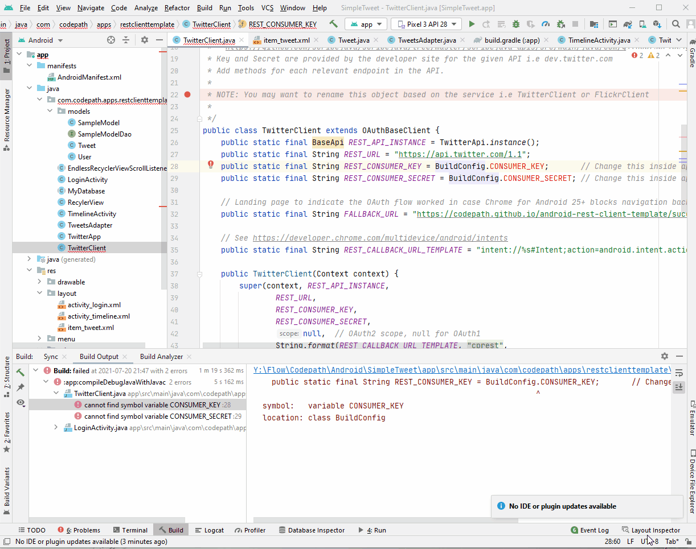
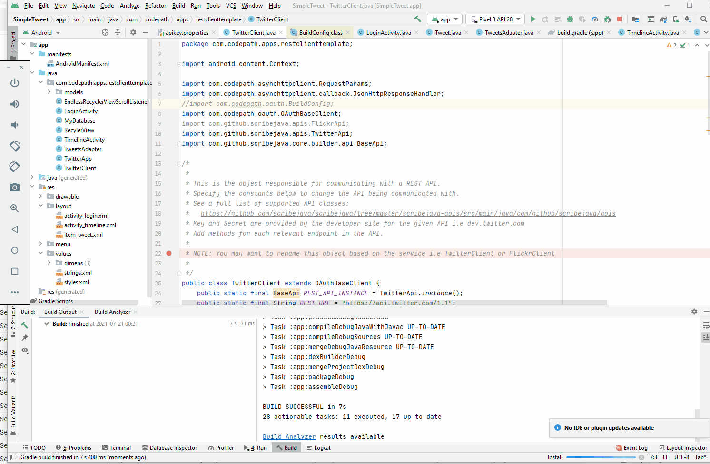
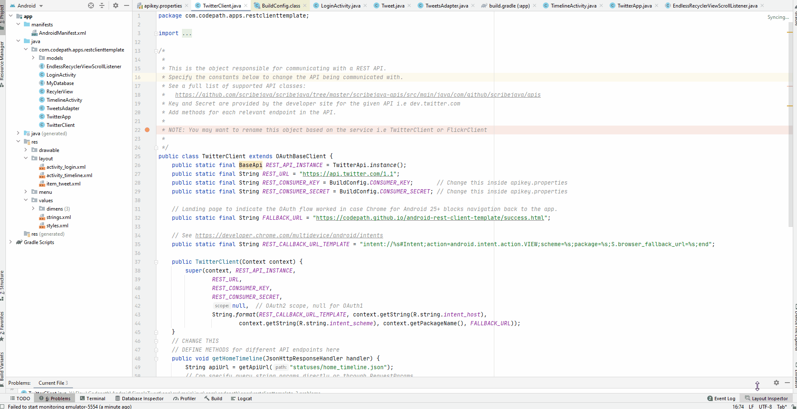
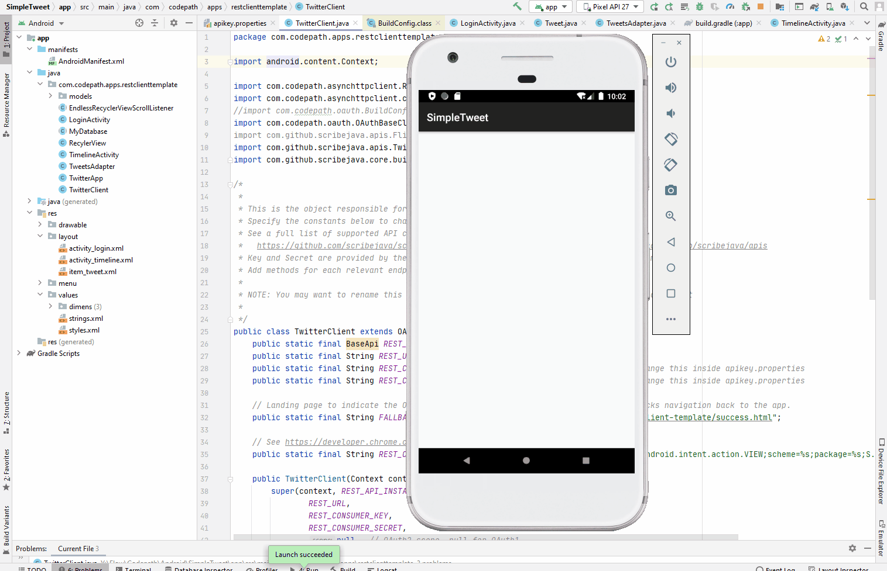

# Project 2 - Twitter Client Part I

**Name of your app** is an android app that allows a user to view his Twitter timeline. The app utilizes [Twitter REST API](https://dev.twitter.com/rest/public).

Time spent: **20** hours spent in total

## User Stories

The following **required** functionality is completed:

- [X] User can **sign in to Twitter** using OAuth login
- [X]	User can **view tweets from their home timeline**
  - [X] User is displayed the username, name, and body for each tweet
  - [X] User is displayed the [relative timestamp](https://gist.github.com/nesquena/f786232f5ef72f6e10a7) for each tweet "8m", "7h"
- [X] User can refresh tweets timeline by pulling down to refresh

The following **optional** features are implemented:

- [X] User can view more tweets as they scroll with infinite pagination
- [ ] Improve the user interface and theme the app to feel "twitter branded"
- [ ] Links in tweets are clickable and will launch the web browser
- [ ] User can tap a tweet to display a "detailed" view of that tweet
- [ ] User can see embedded image media within the tweet detail view
- [ ] User can watch embedded video within the tweet
- [ ] User can open the twitter app offline and see last loaded tweets
- [ ] On the Twitter timeline, leverage the CoordinatorLayout to apply scrolling behavior that hides / shows the toolbar.

The following **additional** features are implemented:

- [ ] List anything else that you can get done to improve the app functionality!

## Video Walkthrough

Here's a walkthrough of implemented user stories:

GIF created with [LiceCap](http://www.cockos.com/licecap/).

## Notes & Challenges

Lots of issues encountered, documented in read me and slack channel. Will keep trying, but wanted to submit prior to deadline. I'm thinking changing tweeter key might resolve issues.

I: Unable to test app on emulator even after rebooting, reinstalling, & changing installation directory. Tried varying API levels between 23 - 30.

  

 

II:  I uninstalled all SDKs, then Android studio, cleared temp files, registry, used CCleaner and ran SFC before reinstalling. All with no luck!

  

III: All I got so far is the white screen and its been like that for ~90 mins. Bear in mind no other programs or resource intensive application(s) are running, so memory isn't an issue, also note that all codes have been written and no parts are missing or skipped. This is on Pixel API 27.

  

IV: The problem persisted even with the break point and BuildConfig removed at the direction of the TA. It's been doing the preloader for quite some time.

 

## Open-source libraries used

- [Android Async HTTP](https://github.com/codepath/CPAsyncHttpClient) - Simple asynchronous HTTP requests with JSON parsing
- [Glide](https://github.com/bumptech/glide) - Image loading and caching library for Android

## License

    Copyright 2021 AOI, Codepath

    Licensed under the Apache License, Version 2.0 (the "License");
    you may not use this file except in compliance with the License.
    You may obtain a copy of the License at

        http://www.apache.org/licenses/LICENSE-2.0

    Unless required by applicable law or agreed to in writing, software
    distributed under the License is distributed on an "AS IS" BASIS,
    WITHOUT WARRANTIES OR CONDITIONS OF ANY KIND, either express or implied.
    See the License for the specific language governing permissions and
    limitations under the License.
